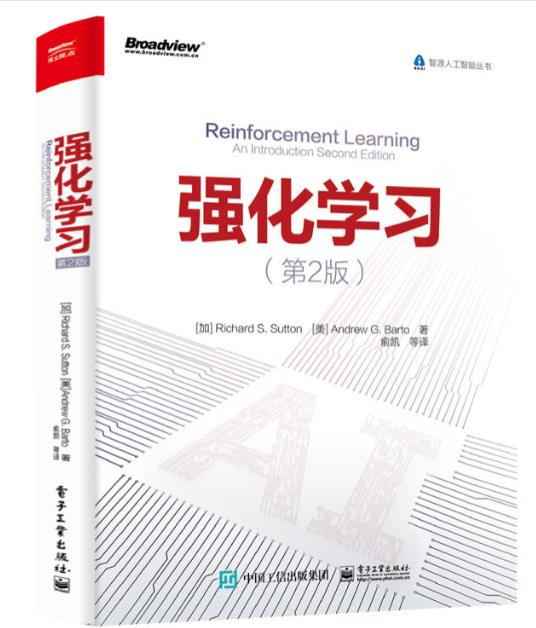

# 《强化学习》读书笔记

## 前言

&emsp;&emsp;[Reinforcement Learning -- An Introduction ](http://incompleteideas.net/book/the-book-2nd.html)是强化学习思想的经典书籍，非常适合搭建理论基础。 原书英文版第二版于2018年出版，可以从官方网站下载书籍的英文版PDF [下载链接](http://incompleteideas.net/book/RLbook2020.pdf)。对于众多中文读者来说，中文官方翻译版这次来得非常及时，[《强化学习》 中文版](https://item.jd.com/12696004.html) 于2019年9月即首次印刷，由电子工业出版社出版。

&emsp;&emsp;本项目记录了我们对《强化学习》的学习笔记，通过对原书习题的解答和代码复现来增加对强化学习的基础理论的认识，梳理强化学习的框架。本项目来源于强化学习爱好者的整理和贡献，包含《强化学习》的习题解答和代码，**仅**供自学者学习和交流，不可直接用于课程作业，何况本项目的解答可能不完全都是正确的。当然如果你发现错误，欢迎提出issue进行指正交流。在学习阅读本项目之前，你需要具有一定的机器学习和深度学习的理论基础，具有Python编程基础。

>GitHub的markdown不再支持tex公式的解析显示，使用Chrome的同学可以安装[GitHub with MathJax](https://chrome.google.com/webstore/detail/github-with-mathjax/ioemnmodlmafdkllaclgeombjnmnbima)添加MathJax的解析以对公式正常显示。

>如果需要直接阅读模式，可以移步至我们的github.io进行阅读：[强化学习读书笔记](https://bcmi.github.io/RL-Solutions/)

## 目录

1. [导论](导论/README.md)
    1. [强化学习概述](导论/README.md)
    1. [习题解答](导论/习题解答.md)
    1. [井字棋小游戏](导论/代码案例.md)
1. [多臂赌博机](多臂赌博机/README.md)
1. [有限马尔科夫决策过程](有限马尔科夫决策过程/README.md)
1. [动态规划](动态规划/README.md)
1. [蒙特卡洛方法](蒙特卡洛方法/README.md)
1. [时序差分学习](时序差分学习/README.md)
1. [n步自举法](n步自举法/README.md)
1. [基于表格方法的规划和学习](基于表格方法的规划和学习/README.md)
1. [基于函数逼近的同轨策略预测](基于函数逼近的同轨策略预测/README.md)
1. [基于函数逼近的同轨策略控制](基于函数逼近的同轨策略控制/README.md)
1. [基于函数逼近的离轨策略方法](基于函数逼近的离轨策略方法/README.md)
1. [资格迹](资格迹/README.md)
1. [策略梯度方法](策略梯度方法/README.md)
1. [表格型深入研究与前沿技术](表格型深入研究与前沿技术/README.md)

## 参与贡献
持续更新中，欢迎贡献便于理解的优秀代码示例，推荐使用Python代码和Jupyter Notebook提交，并附上说明。请将习题解答或者代码案例提交pull request至contributions文件夹下面，每个习题或者案例单独文件(.md,.py 或者 .ipynb) 进行提交，提交后的代码我们将会尽快review并更新至相应的章节:
 + 如果贡献习题解答，命名方式为 ex(chapter)-(execise).md, 例如：第二章第一题ex02-01.md
 + 如果贡献案例代码，命名方式为 case(chapter)-(casename).md,例如：case01-井字棋动态规划案例.md

## 致谢
--------------------
我们分为两个类别的贡献者。
 - 负责人也就是对应的该章节习题解答和案例的维护者。
 - 贡献者对应于主要的开发者。

| 原书章节 | 代码示例  | 负责人 | 主要贡献者 |
| ------------ | ------------ | ------------ | ------------ |
|[第一章 导论](导论/README.md)|[井字棋小游戏](导论/代码案例.md)|@daweicheng|@titicaca
|[第二章 多臂赌博机](多臂赌博机/README.md)||@daweicheng|@CharlieSCC @xiangsheng1325
|[第三章 有限马尔科夫决策过程](有限马尔科夫决策过程/README.md)||@David-Tangk|@David-Tangk
|[第四章 动态规划](动态规划/README.md)||@David-Tangk|@Ti-Ho
|[第五章 蒙特卡洛方法](蒙特卡洛方法/README.md)||@David-Tangk|@VPCU
|[第六章 时序差分学习](时序差分学习/README.md)||@Artiprocher|@Artiprocher @ZP1481616577 
|[第七章 n步自举法](n步自举法/README.md)||@moming|@moming 
|[第八章 基于表格方法的规划和学习](基于表格方法的规划和学习/README.md)|||
|[第九章 基于函数逼近的同轨策略预测](基于函数逼近的同轨策略预测/README.md)|||
|[第十章 基于函数逼近的同轨策略控制](基于函数逼近的同轨策略控制/README.md)|||
|[第十一章 基于函数逼近的离轨策略方法](基于函数逼近的离轨策略方法/README.md)|||
|[第十二章 资格迹](资格迹/README.md)|||
|[第十三章 策略梯度方法](策略梯度方法/README.md)|||

| 参考文献 | | |  |

还有很多同学提出了不少建议，我们都列在此处。

@LxinG-YY @yibo.yan @xiangsheng1325 @CharlieSCC...

如有遗漏，请务必通知我们，可以发邮件至`echo ZGF3ZWkuY2hlbmdAc2p0dS5lZHUuY24K | base64 --decode`。
这是我们必须要感谢的，所以不要不好意思。