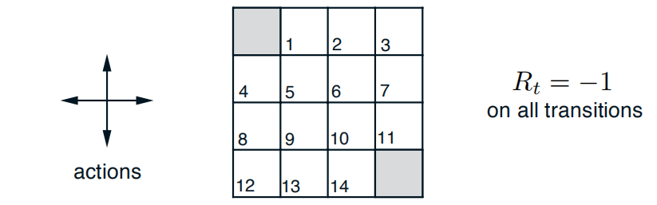
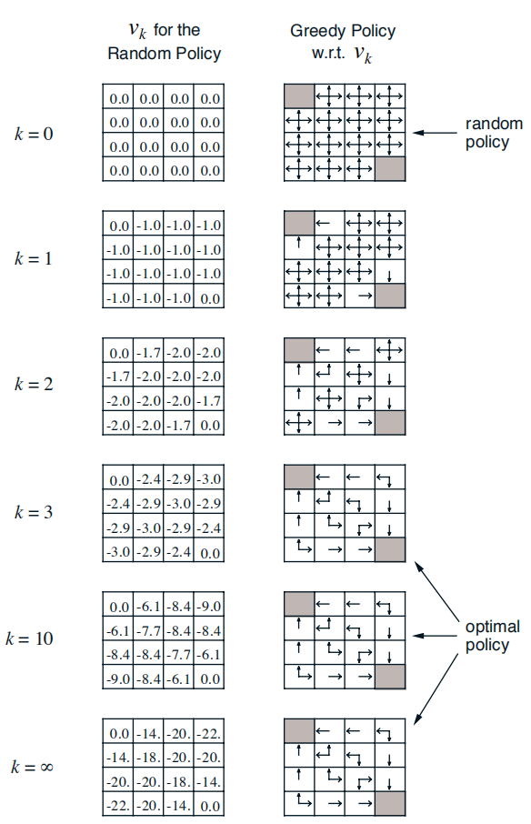
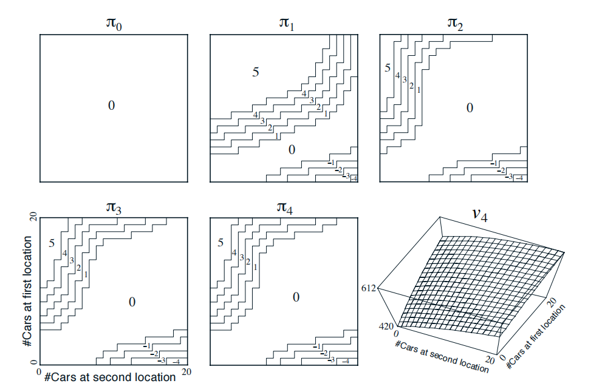

# 第四章 动态规划 习题解答

## -策略评估-

**例 4.1** 考虑下方的一个$4×4$的网络图。

非终止状态集合$S = {\{1, 2, ..., 14\}}$。每个状态有四种可能的动作，$A = {up,down,right,left}$。每个动作会导致状态转移，但当动作会导致智能体移出网络时，状态保持不变。比如，$p(6, -1|5,right)=1$，$p(7,-1|7,right)=1$和对于任意$r\in{R}$，都有$p(10,r|5,right)=0$。这是一个无折扣的分幕式任务。在到达终止状态之前，所有动作的收益均为$-1$。终止状态在图中以阴影显示（尽管图中显示了两个格子，但实际仅有一个终止状态）。对于所有的状态$s,s'$与动作$a$，期望的收益函数均为$r(s,a,s')=-1$。假设智能体采取等概率随机策略（所有动作等可能执行）。下图（左）显示了在迭代策略评估中价值序列$\{v_k\}$的收敛情况。最终的近似估计实际上就是$v_{\pi}$，其值为每个状态到终止状态的步数的期望值，取负。

## 练习4.1

> 在例4.1中，如果$\pi$是等概率随机策略，那么$q_{\pi}(11,down)$是多少？$q_{\pi}(7,down)$呢？

题目分析：由于上例说明这是一个无折扣的分幕式任务，因此在下面的问题当中$\gamma = 1$。另外，特别地，我们将阴影部分的终止状态用$T$来表示。

*解答：*在练习3.13中，我们已经推导出了如何用$v_{\pi}$和四参数函数$p$表达$q_{\pi}$公式：
$$
q_{\pi}(s,a)=\sum_{s',r}p(s',r|s,a)[r + \gamma v_{\pi}(s')]
$$
因此在第一个问题中：（由上图$v_{\pi}$收敛后的图表查出$v_{\pi}(T) = 0$）
$$
q_{\pi}(11,down) = p(T, -1|11,down)[-1 + \gamma v_{\pi}(T)] = 1 * [-1 + 1 * 0] = -1
$$
在第二个问题中：（由上图$v_{\pi}$收敛后的图表查出$v_{\pi}(11) = -14$）
$$
q_{\pi}(7, down) = p(11, -1|7, down)[-1 + \gamma v_{\pi}(11)] = 1 * [-1 + 1 * -14] = -15
$$

## 练习4.2

> 在例4.1中，假设一个新状态15加入到状态13的下方。从状态15开始，采取策略$left、up、right$和$down$，分别到达状态12、13、14和15。假设从原来的状态转出的方式不变，那么$v_{\pi}(15)$在等概率随机策略下是多少？如果状态13的动态特性产生变化，使得采取动作$down$时会到达这个新状态15，这时候的$v_{\pi}(15)$在等概率随机策略下是多少？

*解答：*（1）假设从原来的状态转出的方式不变，这意味着新添加的新状态“15”，对原本其它位置的状态价值函数值不影响，保持不变。我们可以根据书中式4.4计算新状态“15”的状态价值函数：
$$
式4.4：\ v_{\pi}(s) = \sum_{a}\pi(a|s)\sum_{s',r}p(s',r|s,a)[r + \gamma v_{\pi}(s')] \\
\begin{align}
v_{\pi}(15) = \pi(left|15)p(12, -1|15,left)[-1 + 1 * v_{\pi}(12)] \\
+ \pi(up|15)p(13, -1|15,up)[-1 + 1 * v_{\pi}(13)] \\
+ \pi(right|15)p(14, -1|15,right)[-1 + 1 * v_{\pi}(14)] \\
+ \pi(down|15)p(15, -1|15,down)[-1 + 1 * v_{\pi}(15)]
\end{align}
$$
由上图$v_{\pi}$收敛后的图表查出$v_{\pi}(12) = -22$，$v_{\pi}(13) = -20$，$v_{\pi}(14) = -14$,又由于是等概率随机策略,所以$\pi(left|15),\pi(up|15),\pi(right|15),\pi(down|15)$均为$\frac{1}{4}$带入上式化简得：
$$
v_{\pi}(15) = \frac{1}{4}*[-23-21-15-1+v_{\pi}(15)]\\
解得:v_{\pi}(15) = -20
$$
（2）如果状态13的动态特性产生变化，使得采取动作$down$时会到达这个新状态15：

我们需要使用式4.4列出$v_{\pi}(13)$以及$v_{\pi}(15)$的方程组求解，与上一小问类似，带入各值后：
$$
v_{\pi}(13) = \frac{1}{4}\{ [-1 + v_{\pi}(12)] + [-1 + v_{\pi}(9)] + [-1 + v_{\pi}(14)] + [-1 + v_{\pi}(15)]\} \\
v_{\pi}(15) = \frac{1}{4}\{ [-1 + v_{\pi}(12)] + [-1 + v_{\pi}(13)] + [-1 + v_{\pi}(14)] + [-1 + v_{\pi}(15)]\} \\
$$
同样从上图查表化简后，带入$v_{\pi}(12) = -22$，$v_{\pi}(14) = -14$，$v_{\pi}(9) = -20$解得：
$$
v_{\pi}(13) = v_{\pi}(15) = -20
$$
因此结论与第一问一致$v_{\pi}(15) = -20$。

## 练习4.3

> 对于动作价值函数$q_{\pi}$以及其逼近序列函数$q_0, q_1, q_2,...$，类似于式（4.3）、式（4.4）和式（4.5）的公式是什么？

*解答：*类似于式（4.3）、式（4.4）的公式为动作价值函数$q_{\pi}(s, a)$的贝尔曼方程：
$$
\begin{align}
q_{\pi}(s, a) &= \mathbb{E}[G_t|S_t = s, A_t = a] \\
&=\mathbb{E}_{\pi}[R_{t + 1}|S_t = s, A_t = a] + \gamma \mathbb{E}_{\pi}[G_{t + 1|S_t = s, A_t = a}] \\
&=\sum_{s',r}p(s',r|s,a)[r + \gamma \sum_{a'}\pi(a'|s')q_{\pi}(s',a')]
\end{align}
$$
迭代法求近似的动作价值函数，类似于式（4.5）的公式：
$$
q_{k + 1}(s, a) = \sum_{s',r}p(s',r|s,a)[r + \gamma \sum_{a'}\pi(a'|s')q_{k}(s',a')]
$$

## -策略迭代-

**例 4.2 杰克租车问题** 杰克管理一家有两个地点的租车公司。每一天，一些用户会到一个地点租车。如果杰克有可用的汽车，便会将其租出，并从全国总公司哪里获得10美元的收益。如果他在那个地点没有汽车，便会失去这一次业务。租出去的汽车在还车的第二天变得可用。为了保证每辆策划在需要的地方使用，杰克在夜间在两个地点之间移动车辆，移动每辆车的代价为2美元。我们假设每个地点租车与还车的数量是一个泊松随机变量，即数量为$n$的概率为$\frac{\lambda^{n}}{n!}e^{-\lambda}$，其中$\lambda$是期望值。假设租车的$\lambda$在两个地点分别为3和4，而还车的$\sigma$分别是3和2。为了简化问题，我们假设任何一个地点有不超过20辆车（即额外的车会被直接退到全国总公司，所以在这个问题中就意味着自动消失），并且每天最多移动5辆车。我们令折扣$\gamma = 0.9$，并将它描述为一个持续的有限MDP，其中时刻按天计算，状态为每天结束时每个地点的车辆数，动作则为夜间在两个地点间移动的车辆数。下图显示了策略迭代的策略序列，该策略从不移动任何车辆开始。

在杰克租车问题中，策略迭代得到的策略序列以及最终的状态价值函数。前五幅图显示了在一天结束时，在每种状态下（即两地分别的车辆数），从第一地点移动到第二地点的车辆数（负数表示从第二地点转移到第一地点），即采取的动作。每个后继策略都是对之前的策略的严格改进，并且最后的策略是最优的。

---

**算法（使用迭代策略评估），用于估计$\pi \approx \pi_*$**

1. 初始化

   对$s \in S$，任意设定$V(s) \in \mathbb{R}$以及$\pi(s) \in A(s)$

2. 策略评估

   循环：

   ​			$\Delta \gets 0$

   ​			对每一个$s \in S$循环：

   ​						$v \gets V(s)$

   ​						$V(s) \gets \sum_{s',r}p(s',r|s,\pi(s))[r + \gamma V(s')]$

   ​						$\Delta \gets max(\Delta, |v - V(s)|)$

   ​			直到$\Delta < \theta$（一个决定估计精度的小正数）

3. 策略改进

   $policy\_stable \gets true$

   对每一个$s \in S$:

   ​			$old\_action \gets \pi(s)$

   ​			$\pi(s) \gets argmax_a\sum_{s',r}p(s',r|s,a)[r + \gamma V(s')]$

   ​			如果$old\_action \neq \pi(s)$，那么$policy\_stable \gets false$

   如果$policy\_stable$为$true$，那么停止并返回$V \approx v_*$以及$\pi \approx \pi_*$；否则跳转到2

## 练习4.4

> 上面这个策略迭代算法存在一个小问题，即如果在两个或多个同样好的策略之间不断切换，则它可能永远不会终止。所以上面的算法对于教学没有问题，但不适用于实际应用。请修改伪代码以保证其收敛。

*解答：*存在的问题是将$argmax_a$是否稳定作为终止条件，因为在伪代码中的**策略改进**中，同样的价值函数可能会产生不同的策略，导致两个或多个同样好的策略在迭代前后不断切换，价值函数没有提升，但是$old\_action \neq \pi(s)$，仍然会使程序跳转至`2`继续运行。

解决方式为通过增加一个每个状态的最优动作的集合（最优动作集合为让贝尔曼最优方程取到最大值的所有动作），通过判断每一步过后一个状态$s$的最优的动作集合是否改变以及策略$\pi$是否改变来作为终止条件。以下为修改后的伪代码：

1. 初始化

   对$s \in S$，任意设定$V(s) \in \mathbb{R}$以及$\pi(s) \in A(s)$，$maxActionSet(s) \gets set()$ 

   *(这里的每个$maxActionSet(s)$都是一个set集合)*

2. 策略评估

   循环：

   ​			$\Delta \gets 0$

   ​			对每一个$s \in S$循环：

   ​						$v \gets V(s)$

   ​						$V(s) \gets \sum_{s',r}p(s',r|s,\pi(s))[r + \gamma V(s')]$

   ​						$\Delta \gets max(\Delta, |v - V(s)|)$

   ​			直到$\Delta < \theta$（一个决定估计精度的小正数）

3. 策略改进

   $policy\_stable \gets true$

   对每一个$s \in S$:

   ​			$old\_action \gets \pi(s)$

   ​			$old\_max\_action\_set \gets maxActionSet(s)$

   ​			$\pi(s) \gets argmax_a\sum_{s',r}p(s',r|s,a)[r + \gamma V(s')]$

   ​			$maxActionSet(s) \gets \sum_{s',r}p(s',r|s,a)[r + \gamma V(s')]$取到最大值的所有动作$a$的集合
   
   ​			如果$old\_action \neq \pi(s)$并且$old\_max\_action\_set \neq maxActionSet(s)$，那么$policy\_stable \gets false$
   
   如果$policy\_stable$为$true$，那么停止并返回$V \approx v_*$以及$\pi \approx \pi_*$；否则跳转到2

## 练习4.5

> 如何为动作价值定义策略迭代？请用类似这里给出的关于$v_*$的算法写出关于$q_*$的完整算法。请特别注意这个练习，因为本书其它部分会使用到这个算法。

1. 初始化

   对$s \in S, \ a\in A(s)$，任意设定$Q(s, a)$以及$\pi(s, a)$

2. 策略评估

   循环：

   ​			$\Delta \gets 0$

   ​			对每一个$s \in S, a \in A(s)$循环：

   ​						$q \gets Q(s, a)$

   ​						$Q(s, a) \gets \sum_{s',r}p(s',r|s,a)[r + \gamma \sum_{a'}\pi(a'|s')q_{\pi}(s',a')]$

   ​						$\Delta \gets max(\Delta, |v - V(s)|)$

   ​			直到$\Delta < \theta$（一个决定估计精度的小正数）

3. 策略改进

   $policy\_stable \gets true$

   对每一个$s \in S$:

   ​			$old\_action \gets \pi(s)$

   ​			$\pi(s) \gets argmax_a\sum_{s',r}p(s',r|s,a)[r + \gamma V(s')]$

   ​			如果$old\_action \neq \pi(s)$，那么$policy\_stable \gets false$

   如果$policy\_stable$为$true$，那么停止并返回$V \approx v_*$以及$\pi \approx \pi_*$；否则跳转到2

## 练习4.6

> 假设只能考虑$\epsilon-柔性$策略，即在每个状态$s$中选择每个动作的概率至少为$\epsilon / |A(s)|$。请定性描述在$v_*$的策略迭代算法中，步骤3、步骤2、步骤1所需的更改。

步骤1-初始化中的更改：

只需要将确定的策略$\pi(s), \pi(s) \in A(s)$，改为随机的策略$\pi(a|s), s\in S, a \in A(s)$。

步骤2-策略评估中的更改：

将贝尔曼更新改为$V(s) \gets \sum_{a \in A(s)}\pi(a|s)\sum_{s',r}p(s',r|s,a)[r + \gamma V(s')]$

步骤3-策略改进中的更改：

将$\pi(s) \gets argmax_a\sum_{s',r}p(s',r|s,a)[r + \gamma V(s')]$改为以下：
$$
\pi(a|s)=\left\{
\begin{aligned}
& \epsilon/|A| + 1 - \epsilon \ &if \ a^* = argmax_a\sum_{s',r}p(s',r|s,a)[r + \gamma V(s')]\\
& \epsilon/|A|  & 其它\\
\end{aligned}
\right.
$$
