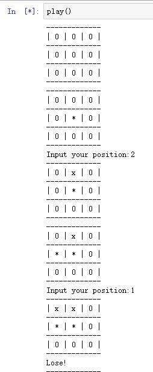

# 第一章 导论 案例“井字棋”小游戏


> 回顾：井字棋，两个玩家轮流在一个3$\times$3的棋盘上下棋，一方下X,一方下O，直到其中的一方在行、列或者对角线上占据三个子（如上图的X玩家），则该方获胜。如果棋盘被占满后没有任何一方有连续三个连着的棋子，那么游戏为平局。

这个游戏很简单，已经有很多成熟的解法，比如博弈论，动态规划，经典的优化方法，进化算法等。本案例中使用强化学习中的时序差分学习方法。即更新策略为
$$V(S_t) \leftarrow V(S_t) + \alpha\[V(S_{t+1}-V(S_t))\] $$
其中$\alpha$是一个很小的正分数，成为步长参数，影响学习速率。在每一个步骤中，价值变化的部分依赖于两个不同时刻的状态的价值的差。

## 代码说明

首先定义状态类，包括棋局的状态的保存，结束的判断等功能

```python
class State:
    def __init__(self):
        # the board is represented by a n * n array,
        # 1 represents chessman of the player who moves first,
        # -1 represents chessman of another player
        # 0 represents empty position
        self.data = np.zeros((BOARD_ROWS, BOARD_COLS))
        self.winner = None
        self.hashVal = None
        self.end = None

    # calculate the hash value for one state, it's unique
    def getHash(self):
        if self.hashVal is None:
            self.hashVal = 0
            for i in self.data.reshape(BOARD_ROWS * BOARD_COLS):
                if i == -1:
                    i = 2
                self.hashVal = self.hashVal * 3 + i
        return int(self.hashVal)

    # determine whether a player has won the game, or it's a tie
    def isEnd(self):
        if self.end is not None:
            return self.end
        results = []
        # check row
        for i in range(0, BOARD_ROWS):
            results.append(np.sum(self.data[i, :]))
        # check columns
        for i in range(0, BOARD_COLS):
            results.append(np.sum(self.data[:, i]))

        # check diagonals
        results.append(0)
        for i in range(0, BOARD_ROWS):
            results[-1] += self.data[i, i]
        results.append(0)
        for i in range(0, BOARD_ROWS):
            results[-1] += self.data[i, BOARD_ROWS - 1 - i]

        for result in results:
            if result == 3:
                self.winner = 1
                self.end = True
                return self.end
            if result == -3:
                self.winner = -1
                self.end = True
                return self.end

        # whether it's a tie
        sum = np.sum(np.abs(self.data))
        if sum == BOARD_ROWS * BOARD_COLS:
            self.winner = 0
            self.end = True
            return self.end

        # game is still going on
        self.end = False
        return self.end

    # @symbol 1 or -1
    # put chessman symbol in position (i, j)
    def nextState(self, i, j, symbol):
        newState = State()
        newState.data = np.copy(self.data)
        newState.data[i, j] = symbol
        return newState

    # print the board
    def show(self):
        for i in range(0, BOARD_ROWS):
            print('-------------')
            out = '| '
            for j in range(0, BOARD_COLS):
                if self.data[i, j] == 1:
                    token = '*'
                if self.data[i, j] == 0:
                    token = '0'
                if self.data[i, j] == -1:
                    token = 'x'
                out += token + ' | '
            print(out)
        print('-------------')
```

定义判别类，包括返回奖励，返回状态以及模拟当前棋局状态等

```python
class Judger:
    # @player1: player who will move first, its chessman will be 1
    # @player2: another player with chessman -1
    # @feedback: if True, both players will receive rewards when game is end
    def __init__(self, player1, player2, feedback=True):
        self.p1 = player1
        self.p2 = player2
        self.feedback = feedback
        self.currentPlayer = None
        self.p1Symbol = 1
        self.p2Symbol = -1
        self.p1.setSymbol(self.p1Symbol)
        self.p2.setSymbol(self.p2Symbol)
        self.currentState = State()
        self.allStates = allStates

    # give reward to two players
    def giveReward(self):
        if self.currentState.winner == self.p1Symbol:
            self.p1.feedReward(1)
            self.p2.feedReward(0)
        elif self.currentState.winner == self.p2Symbol:
            self.p1.feedReward(0)
            self.p2.feedReward(1)
        else:
            self.p1.feedReward(0.1)
            self.p2.feedReward(0.5)

    def feedCurrentState(self):
        self.p1.feedState(self.currentState)
        self.p2.feedState(self.currentState)

    def reset(self):
        self.p1.reset()
        self.p2.reset()
        self.currentState = State()
        self.currentPlayer = None

    # @show: if True, print each board during the game
    def play(self, show=False):
        self.reset()
        self.feedCurrentState()
        while True:
            # set current player
            if self.currentPlayer == self.p1:
                self.currentPlayer = self.p2
            else:
                self.currentPlayer = self.p1
            if show:
                self.currentState.show()
            [i, j, symbol] = self.currentPlayer.takeAction()
            self.currentState = self.currentState.nextState(i, j, symbol)
            hashValue = self.currentState.getHash()
            self.currentState, isEnd = self.allStates[hashValue]
            self.feedCurrentState()
            if isEnd:
                if self.feedback:
                    self.giveReward()
                return self.currentState.winner

```

定义AI棋手类，该类为主要的训练目标，负责根据奖励调整策略，采取动作，存储最优策略等

```python
# AI player
class Player:
    # @stepSize: step size to update estimations
    # @exploreRate: possibility to explore
    def __init__(self, stepSize = 0.1, exploreRate=0.1):
        self.allStates = allStates
        self.estimations = dict()
        self.stepSize = stepSize
        self.exploreRate = exploreRate
        self.states = []

    def reset(self):
        self.states = []

    def setSymbol(self, symbol):
        self.symbol = symbol
        for hash in self.allStates.keys():
            (state, isEnd) = self.allStates[hash]
            if isEnd:
                if state.winner == self.symbol:
                    self.estimations[hash] = 1.0
                else:
                    self.estimations[hash] = 0
            else:
                self.estimations[hash] = 0.5

    # accept a state
    def feedState(self, state):
        self.states.append(state)

    # update estimation according to reward
    def feedReward(self, reward):
        if len(self.states) == 0:
            return
        self.states = [state.getHash() for state in self.states]
        target = reward
        for latestState in reversed(self.states):
            value = self.estimations[latestState] + self.stepSize * (target - self.estimations[latestState])
            self.estimations[latestState] = value
            target = value
        self.states = []

    # determine next action
    def takeAction(self):
        state = self.states[-1]
        nextStates = []
        nextPositions = []
        for i in range(BOARD_ROWS):
            for j in range(BOARD_COLS):
                if state.data[i, j] == 0:
                    nextPositions.append([i, j])
                    nextStates.append(state.nextState(i, j, self.symbol).getHash())
        if np.random.binomial(1, self.exploreRate):
            np.random.shuffle(nextPositions)
            # Not sure if truncating is the best way to deal with exploratory step
            # Maybe it's better to only skip this step rather than forget all the history
            self.states = []
            action = nextPositions[0]
            action.append(self.symbol)
            return action

        values = []
        for hash, pos in zip(nextStates, nextPositions):
            values.append((self.estimations[hash], pos))
        np.random.shuffle(values)
        values.sort(key=lambda x: x[0], reverse=True)
        action = values[0][1]
        action.append(self.symbol)
        return action

    def savePolicy(self):
        fw = open('optimal_policy_' + str(self.symbol), 'wb')
        pickle.dump(self.estimations, fw)
        fw.close()

    def loadPolicy(self):
        fr = open('optimal_policy_' + str(self.symbol),'rb')
        self.estimations = pickle.load(fr)
        fr.close()
```

定义人类棋手类，负责接收人类下棋动作，更改棋局状态

```python
# human interface
# input a number to put a chessman
# | 1 | 2 | 3 |
# | 4 | 5 | 6 |
# | 7 | 8 | 9 |
class HumanPlayer:
    def __init__(self, stepSize = 0.1, exploreRate=0.1):
        self.symbol = None
        self.currentState = None
        return
    def reset(self):
        return
    def setSymbol(self, symbol):
        self.symbol = symbol
        return
    def feedState(self, state):
        self.currentState = state
        return
    def feedReward(self, reward):
        return
    def takeAction(self):
        data = int(input("Input your position:"))
        data -= 1
        i = data // int(BOARD_COLS)
        j = data % BOARD_COLS
        if self.currentState.data[i, j] != 0:
            return self.takeAction()
        return (i, j, self.symbol)
```

以下为函数定义

训练函数：模拟20000次对战，选取最优策略

```python
def train(epochs=20000):
    player1 = Player()
    player2 = Player()
    judger = Judger(player1, player2)
    player1Win = 0.0
    player2Win = 0.0
    for i in range(0, epochs):
        print("Epoch", i)
        winner = judger.play()
        if winner == 1:
            player1Win += 1
        if winner == -1:
            player2Win += 1
        judger.reset()
    print(player1Win / epochs)
    print(player2Win / epochs)
    player1.savePolicy()
    player2.savePolicy()
```

对战函数：根据训练的策略，模拟500局对战，输出两种策略胜率

```python
def compete(turns=500):
    player1 = Player(exploreRate=0)
    player2 = Player(exploreRate=0)
    judger = Judger(player1, player2, False)
    player1.loadPolicy()
    player2.loadPolicy()
    player1Win = 0.0
    player2Win = 0.0
    for i in range(0, turns):
        print("Epoch", i)
        winner = judger.play()
        if winner == 1:
            player1Win += 1
        if winner == -1:
            player2Win += 1
        judger.reset()
    print(player1Win / turns)
    print(player2Win / turns)
```

游戏函数：提供接口，人机对战

```python
def play():
    while True:
        player1 = Player(exploreRate=0)
        player2 = HumanPlayer()
        judger = Judger(player1, player2, False)
        player1.loadPolicy()
        winner = judger.play(True)
        if winner == player2.symbol:
            print("Win!")
        elif winner == player1.symbol:
            print("Lose!")
        else:
            print("Tie!")
```

状态函数及其实现：用于获取所有棋局状态

```python
def getAllStatesImpl(currentState, currentSymbol, allStates):
    for i in range(0, BOARD_ROWS):
        for j in range(0, BOARD_COLS):
            if currentState.data[i][j] == 0:
                newState = currentState.nextState(i, j, currentSymbol)
                newHash = newState.getHash()
                if newHash not in allStates.keys():
                    isEnd = newState.isEnd()
                    allStates[newHash] = (newState, isEnd)
                    if not isEnd:
                        getAllStatesImpl(newState, -currentSymbol, allStates)

def getAllStates():
    currentSymbol = 1
    currentState = State()
    allStates = dict()
    allStates[currentState.getHash()] = (currentState, currentState.isEnd())
    getAllStatesImpl(currentState, currentSymbol, allStates)
    return allStates

# all possible board configurations
allStates = getAllStates()
```

调用函数，查看运行结果

```python
train()
compete()

play()
```

该游戏只要采取正确策略，都会以平局结束，500局模拟对战结果也全为平局

完整代码地址：[查看完整代码](src/TicTacToe.ipynb)

## 运行效果


