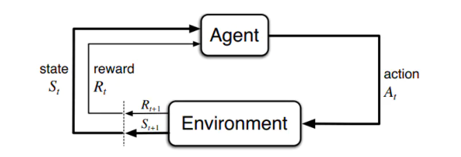

 ## 
 # 第三章 有限马尔科夫决策过程

本章主要介绍有限马尔科夫决策过程（有限MDP），该部分是以后章节的基础，所以对本章相关概念的理解是至关重要的。

首先我们要知道MDP是序列决策的经典形式化表示，而在强化学习中，agent和environment一直在互动。在任意时刻t，agent都会接受到一个状态St，基于这个状态，agent会做出动作At，然后作用在环境上，然后agent会接受奖励Rt+1和新的状态St+1。所以，agent和environment之间的交互就产生了一个序列

​																				S0，A0，R1，S1，A1，R2，······

因此，我们借助马尔科夫假设，这个序列问题就会变得更简单。虽然说强化学习的下一个状态的产生跟所有历史状态是有关的，但是马尔科夫假设当前状态信息包含了所有相关的历史，只要当前状态已知，所有的历史信息都可以扔掉，当前状态就可以决定未来。

需要知道的是，在赌博机问题中，我们估计了当前动作的价值；而在MDP中，我们需要估计每个动作在每个状态中的价值，或者估计给定最优动作下的每个状态的价值。

## 本节目录
1.[习题解答](习题解答.md)
